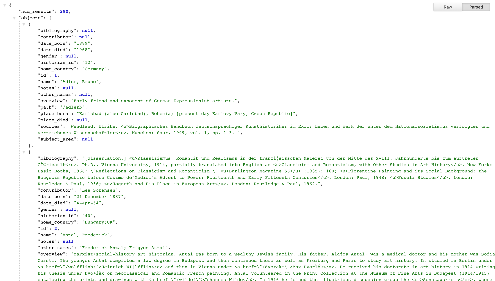

# Database of Art Historians API
> Small API for Database of Art Historians Project



## Installation

Setup the Application:

```sh
pip -r requirements.txt
python create_db.py
python fill_db.py
```

Running the Application:
```sh
python app.py

navitate to:
localhost:5000/api/historian
```

## Usage example

Query All Historians:<br>
```sh
curl http://127.0.0.1:5000/api/historian
```

Query Historian #30:<br>
```sh
curl http://127.0.0.1:5000/api/historian/30
```

Search for Historian with name like "Frederick":<br>
```sh
curl -G -H "Content-type: application/json" -d "q={\"filters\":[{\"name\":\"name\",\"op\":\"like\",\"val\":\"%Frederick%\"}]}" http://127.0.0.1:5000/api/historian
```

_For more examples and usage, please refer to the [Wiki][wiki]._

## Release History
* 0.0.1
    * Work in progress

## Meta

Distributed under the MIT license. See ``LICENSE`` for more information.

[https://github.com/dukewired/database_art_historians_api](https://github.com/dukewired/database_art_historians_api/)

## Contributing

1. Fork it (<https://github.com/dukewired/database_art_historians_api/fork>)
2. Create your feature branch (`git checkout -b feature/fooBar`)
3. Commit your changes (`git commit -am 'Add some fooBar'`)
4. Push to the branch (`git push origin feature/fooBar`)
5. Create a new Pull Request
